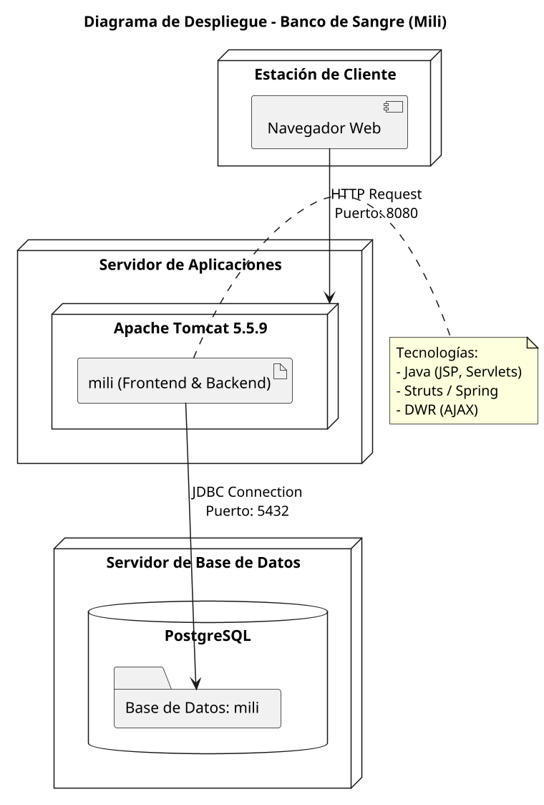

# Diagrama de Despliegue - Banco de Sangre

Este archivo contiene el código PlantUML para generar el diagrama de despliegue del proyecto. Puedes visualizar este diagrama usando un plugin de PlantUML para VS Code o servidores de renderizado online.

## Código PlantUML

